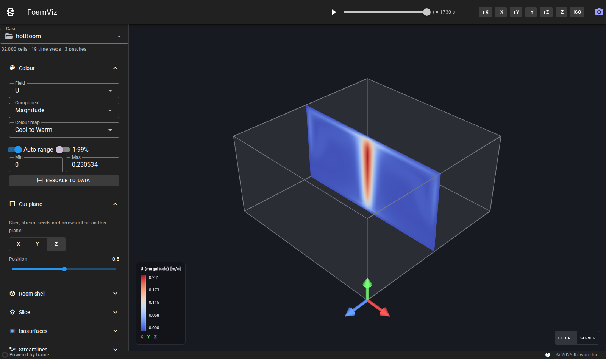
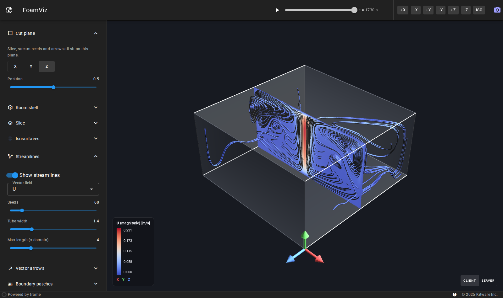
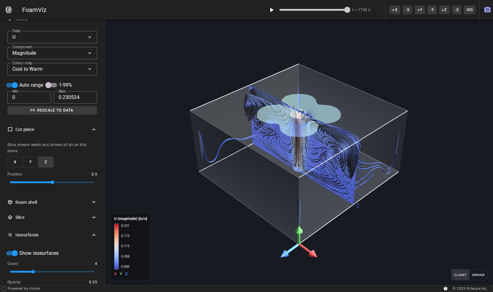

# FoamViz — OpenFOAM post-processing in a browser, with Trame

An experiment in serving OpenFOAM case data as an interactive 3D visualisation
over HTTP, aimed at what an IDA ICE CFD backend would need: open a solved case,
pick a field, cut a plane through the room, see where the air actually goes.

Built on [Trame](https://kitware.github.io/trame/) (Kitware's Python/Vue
framework) over VTK's native `vtkOpenFOAMReader` — no intermediate conversion
step, no `foamToVTK`, no ParaView install.



## Running it

```bash
python3 -m venv .venv
.venv/bin/pip install -r requirements.txt
.venv/bin/python main.py --port 8080          # add --server to not open a browser
```

Then open <http://localhost:8080/>.

### Which VTK

Plain `vtk` from PyPI, **9.4 or newer**. Since 9.4 the standard wheels carry
both an EGL and an OSMesa render window and choose one at runtime — X11 first,
then EGL, then OSMesa — so headless rendering needs no special build. VTK
`dlopen`s those libraries rather than bundling them, so a slim container needs:

```bash
apt-get install -y libosmesa6      # or: dnf install -y mesa-libOSMesa
```

A normal Linux workstation already has it. Check with:

```bash
python -c "import vtk; w=vtk.vtkRenderWindow(); w.SetOffScreenRendering(1); w.Render(); print(w.GetClassName())"
# vtkOSOpenGLRenderWindow  (or vtkEGLRenderWindow on a GPU machine)
```

**`vtk-osmesa` is a fallback, not the recommendation.** It statically bundles
OSMesa so it needs no system library, but it is not on PyPI (it lives only on
`https://wheels.vtk.org`, which redirects to a GitLab package index), it stopped
at **9.3.1**, and it publishes wheels only for CPython 3.6–3.12 on Linux x86_64
and Windows. On Python 3.13+, macOS or arm64 it will not resolve at all — which
is the usual reason `pip install vtk-osmesa` fails. Reach for it only where you
cannot install `libosmesa6`.

trame pins no VTK version of its own. This app is verified on both 9.3.1 and
9.6.2, including vtk.js client-side rendering.

`--data DIR` points at either a single case directory or a directory of them; a
case is anything containing `system/controlDict`. The bundled demo lives in
`data/hotRoom`.

### Deep-linking a case

Append `?case=<name>` to the URL to open a specific case directly, e.g.
`http://localhost:8080/?case=hotRoom` — `<name>` is the case directory name as
listed in the drawer. This is what lets a host application (the CFD backend)
embed the viewer for one case via an `<iframe>`. It is handled server-side and,
because the session is shared, it sets the one shared scene.

## What it does

| Control group | What you get |
|---|---|
| **Colour** | Any cell/point field the case contains; magnitude or X/Y/Z for vectors; nine colour maps; automatic, percentile (1–99 %) or manual range |
| **Cut plane** | An X/Y/Z-aligned plane, positioned by slider — the anchor for everything below |
| **Room shell** | Boundary patches as a translucent envelope, optionally coloured by field, with mesh edges, and optionally cut away at the plane so you can see inside |
| **Slice** | The field on the cut plane, with optional mesh edges |
| **Isosurfaces** | 1–12 nested isosurfaces of the coloured field |
| **Streamlines** | RK45 integration seeded from the cut plane, drawn as tubes coloured by the field |
| **Vector arrows** | Glyphs on the plane or through the volume, uniform length or scaled by magnitude |
| **Boundary patches** | Choose which patches to read at all — the reader skips the rest |
| Toolbar | Time-step slider and play button, six axis-aligned camera presets plus iso, PNG download |

The cut plane deliberately drives the slice, the stream seeds *and* the glyphs.
For room airflow that matches how a result actually gets read: choose a plane,
then ask what the air is doing on it.

### Two rendering modes

Bottom-right of the view switches between them at runtime:

- **Client** — geometry is serialised to the browser and drawn by vtk.js.
  Camera interaction costs no round trips; good over a slow link, at the cost of
  shipping the geometry.
- **Server** — the server renders with OSMesa and streams frames. The client
  needs no GPU and the geometry never leaves the server, which is what you want
  for a case too large to ship.

Both show the same picture because the colour scalars are baked into a real
data array rather than computed at render time (see below). The one visible
difference: vtk.js blends stacked translucent surfaces more aggressively, so
many nested isosurfaces look brighter in client mode.

## Demo case

`data/hotRoom` is OpenFOAM 13's `fluid/hotRoomBoussinesqSteady` tutorial,
refined to 40×20×40 (32 000 cells) — a 10 × 5 × 10 m room with a 1 m² patch of
floor held at 600 K. It converged in 1730 iterations and wrote 19 time
directories, so the time slider has something to animate.

It was chosen as the closest tutorial analogue to an IDA ICE `HEATING` case:
buoyancy-driven room airflow with a thermal plume, steady-state, k–ε closure.
To regenerate:

```bash
source /opt/cfd/OpenFOAM-13/etc/bashrc
cd data/hotRoom && ./Allclean && ./Allrun
```

## Screenshots

| Streamlines seeded on the plane | Isosurfaces of speed |
|---|---|
|  |  |

## Layout

```
main.py              CLI entry point
foamviz/case.py      vtkOpenFOAMReader wrapper: times, fields, patches, snapshots
foamviz/pipeline.py  the VTK scene: representations, colouring, render window
foamviz/colors.py    colour map presets, shared by the 3D view and the legend
foamviz/app.py       Trame UI: state, widgets, layout
tests/               see below
```

### Design decisions worth knowing

**Colour scalars are baked into an array.** Instead of asking the mapper for
"the magnitude of U" at render time, `pipeline.py` computes a plain scalar array
(`FoamVizColor`) and colours by that. Vector modes on a lookup table are a
render-side concept that does not survive serialisation to vtk.js, so baking
them keeps the two rendering modes identical and makes the data range trivially
correct. It also means isosurfaces contour whatever you are currently colouring
by, which turns out to be the intuitive behaviour.

**The reader is pulled, not connected.** `FoamCase.load()` requests a time step
and hands downstream filters a concrete snapshot via `SetInputData`. Requesting
time through a connected pipeline means every downstream `Update()`
re-negotiates the time request, and it is easy to silently fall back to `t=0`.

**Patch selection is a read-time filter.** Deselecting patches stops the reader
from loading them at all rather than hiding actors, which is the part that
matters once cases get large.

## Tests

```bash
.venv/bin/python tests/test_pipeline.py     # 29 checks, ~15 s, no browser
.venv/bin/python tests/browser_check.py     # drives the real page, needs playwright
```

`test_pipeline.py` checks the reader and every representation by **output
size**, not by exit status: an empty VTK filter raises nothing and renders as a
perfectly plausible blank image, so the only useful question is whether
geometry came out the other end.

`browser_check.py` exists because a Trame app fails in ways the server never
sees — a Vue template that will not compile, a state variable the client never
receives, a vtk.js scene that arrives empty. It launches the server, drives
Chromium through nine steps (both render modes, time stepping, colour-map
switch, PNG download), asserts the view is not blank, and fails on any console
error. Screenshots land in `--out`.

Note that it reads rendered pixels from a **page screenshot**, not from the
canvas: a WebGL context without `preserveDrawingBuffer` reads back empty once
the frame has been presented, so `drawImage` reports a blank canvas for a view
that is plainly visible on screen.

### Headless browser dependencies

Playwright's Chromium needs system libraries (glib, nss, dbus, …) that are not
in this container and cannot be installed without root. They were staged into a
user-writable prefix instead:

```bash
apt-get update -o Dir::State::Lists=$PWD/lists -o Dir::Cache=$PWD/cache
apt-get install --print-uris -y --no-install-recommends libglib2.0-0t64 libnss3 \
  libnspr4 libdbus-1-3 libatk1.0-0t64 libatk-bridge2.0-0t64 libatspi2.0-0t64 \
  libcups2t64 libdrm2 libgbm1 libxkbcommon0 libpango-1.0-0 libcairo2 \
  libasound2t64 libx11-6 libxcb1 libxcomposite1 libxdamage1 libxext6 \
  libxfixes3 libxrandr2 libexpat1 | grep -oP "(?<=')http[^']+" > uris.txt
xargs -n1 -P8 curl -sSOL < uris.txt
for d in *.deb; do dpkg-deb -x "$d" root/; done
export LD_LIBRARY_PATH=$PWD/root/usr/lib/x86_64-linux-gnu:$PWD/root/lib/x86_64-linux-gnu
```

Only `browser_check.py` needs this. The app itself renders through OSMesa and
has no such dependency.

## Where this would need work for production

- **Sliders re-render live.** Every slider pushes state on each drag tick, and
  each tick rebuilds the scene. Harmless on the demo case, wasteful on a large
  one. The fix is to debounce the expensive sliders to their release event;
  see `CLAUDE.md` for the approach. Known and deferred.
- **Multiple users.** A single Trame server holds one VTK pipeline and one
  camera. Concurrent users need the Trame launcher, one process per session.
- **Decomposed cases.** Only reconstructed cases are read. `processor*`
  directories would need `vtkPOpenFOAMReader` or a `reconstructPar` step.
- **The `/paraview/` 405.** trame-vtk's client probes for a ParaView-backed
  server on startup; we serve plain VTK, so it 405s harmlessly. Cosmetic, but it
  shows up in the browser console.

Scale is *not* on this list: tested to 12 M cells, with client-side rendering
holding up well. Note that an IDA ICE "zone" is a room selected for analysis,
not an OpenFOAM `cellZone` — cases are treated as single-region, single-zone.
- **Comfort metrics.** The IDA ICE side cares about draught rate, PMV/PPD and
  operative temperature, none of which are OpenFOAM fields. They would be
  derived arrays computed on load — a natural extension of the same baked-array
  mechanism used for colouring.
